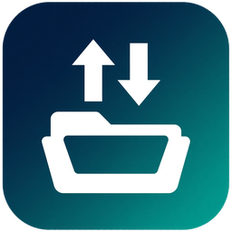
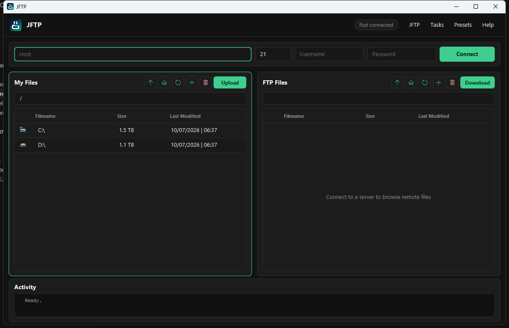

# JFTP

[](LICENSE)



JFTP is a desktop FTP client for moving files between this computer and a server. It was written by Jared Scarito so new builds could be uploaded to a Raspberry Pi as soon as they were ready, without digging through a clunky client each time.



## What you can do

**Connect.** Type a host, port, username, and password, then click **Connect**. The same button disconnects. The status chip in the header shows whether you are connected. An empty port uses your default (21 unless you change it in Preferences).

**Browse both sides.** My Files is this computer, starting at your drives. FTP Files is the server, and it stays empty until you connect. Double-click a folder to open it. The path bar under each title shows where you are.

**Transfer.** Select local files and click **Upload** to send them to the folder open on the server. Select remote files and click **Download** to save them into the folder open on this computer.

**Manage files.** Each pane has buttons for up one level, home, refresh, new file or folder, and delete. The green outline marks the pane that menu commands apply to.

**Keep a log.** The Activity panel records connect, transfer, and error messages.

## Window guide

| Control | What it does |
|---|---|
| Up, home, refresh | Leave a folder, return to the top, or reload the list |
| New | Create a file or folder in the open directory |
| Delete | Remove the selection, after a confirmation if that setting is on |
| Upload / Download | Send the selection to the other pane's current folder |
| Right-click | Copy, paste, rename, and upload or download |

### Menus

- **JFTP** holds Preferences and Exit. Preferences sets the default port and whether delete asks first.
- **Tasks** repeats create, rename, delete, upload, download, and refresh for the outlined pane.
- **Presets** saves the current host, port, and username. Passwords are not stored. Choosing a preset fills the fields so you only need to type the password and connect.
- **Help** opens About and a link to the project page.

## Run it

JFTP needs **Java 8**. Later JDKs do not include JavaFX, which this app uses. It also needs [Apache Commons Net 3.6](https://commons.apache.org/proper/commons-net/) and [Apache Commons IO 2.6](https://commons.apache.org/proper/commons-io/) on the classpath.

From the project folder, after IntelliJ (or `javac`) has compiled into `out/production/JFTP`:

```text
java -cp "out/production/JFTP;commons-net-3.6.jar;commons-io-2.6.jar" com.jaredscarito.jftp.controller.MainController
```

Point the last two entries at wherever those jars actually live.

In IntelliJ, open the project and run `com.jaredscarito.jftp.controller.MainController`. The module already lists those two libraries.

## License

MIT. See [LICENSE](LICENSE). Copyright (c) 2018 Jared Scarito.
